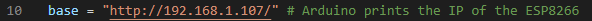

# Jetson Nano Object detection and following

Procedure to make inference in Jetson Nano.

## Set up Jetson Nano

Go to [this](https://jetbot.org/master/) step by step tutorial.

## Install dependecies and download packages

Firs of all we will have to install python dependecies. For that open a terminal an execute the followin commands.

```bash
sudo apt-get update
sudo apt-get install python3-pip -y
sudo apt-get install dialog -y # Download the model
sudo apt-get install v4l2loopback-dkms # To display the image
sudo modprobe v4l2loopback
sudo apt-get install nano 
```

## Prepare the docker container

First of all we need to clone the repository of jetson inference and go to the folder jetson_inference.

```bash
git clone https://github.com/mikelalda/Jetbot-follower.git

```

Clone jetson-inference repository

```bash
git clone https://github.com/dusty-nv/jetson-inference.git


```

Each time to run the container follow the next steps:

```bash
cd jetdon-inference
docker/run.sh --volume path_to/Jetbot-follower/:/Jetbot-follower
```

## Run inference

In the file Alarm-Yolo/main.py we need to change the line 10 with ESP8266 IP address.



Also the change the wifi of the ESP8266 in line 13 of Arduino code.


Once having done all the steps, run this in the docker terminal.

```bash
cd /Jetbot-follower
python3 main.py
```
